import { PlusBadge, ProBadge } from "/snippets/badge.mdx";

<Note>
This changelog documents product updates and new features in Flashquotes. These updates are rolled out directly to the live application - no separate changelog feature exists within the app itself.
</Note>

<Update label="November 13, 2025">

## Rich Text Editor for Special Notes

Special notes on quotes and events now use a visual rich text editor instead of Markdown. Format your internal notes with bold, italic, headings, lists, links, and dividers using familiar toolbar buttons - no Markdown syntax required.

**What's New:**
- **Visual Formatting Toolbar**: Format text with buttons instead of typing Markdown
- **Full Formatting Support**: Bold, italic, underline, strikethrough, headings (H1-H3), bullet and numbered lists, horizontal rules, and links
- **Keyboard Shortcuts**: Press `Cmd+Enter` (Mac) or `Ctrl+Enter` (Windows) to save quickly
- **Backwards Compatible**: Existing Markdown notes automatically convert when you edit them

Perfect for creating well-organized internal notes with clear structure and formatting. Special notes remain internal-only and are not visible to customers.

</Update>

<Update label="November 12, 2025">

## Import Bookings from CSV

Save time migrating data or adding historical bookings with the new CSV import feature. Upload up to 100 bookings at once using a simple spreadsheet format, perfect for businesses transitioning from other systems or adding past events to Flashquotes.

**What's New:**
- **CSV Template**: Download a pre-formatted template with all required fields and example data
- **Column Mapping**: Upload your CSV and map columns to Flashquotes fields with auto-matching
- **Real-time Validation**: Errors are highlighted before import with specific guidance on fixes
- **Background Processing**: Large imports run in the background with progress tracking and detailed results

**How It Works:**
1. Download the CSV template from the Import Bookings page
2. Fill in your booking data with event details, client info, and pricing
3. Upload and map your columns to Flashquotes fields
4. Review validation, fix any errors, then import
5. Track progress and view results with success/failure breakdown

Imported bookings include all event details, timeline entries, and trigger event brief tasks automatically. Email notifications are not sent during import to avoid duplicate communications.

[Learn how to import bookings →](/imports-exports/import-bookings)

---

## Bulk Apply Admin Tasks to Upcoming Events

When you update your admin task templates, apply those changes to all upcoming events with one click. Go to Settings → Tasks → Admin Default Tasks, click the menu icon, and select "Apply to events" to sync your latest task checklist across all future bookings.

</Update>

<Update label="November 10, 2025">

## Auto-Invite Staff to Calendar Events <ProBadge />

Automatically manage Google Calendar attendees when staff is assigned to or removed from events. When enabled, assigned staff members receive calendar invitations via email, ensuring everyone knows about their scheduled events without manual invite management.

**Perfect For:**
- Teams that need calendar-based event notifications
- Ensuring staff have event details in their personal calendars
- Eliminating manual calendar invite workflows
- Keeping team schedules synchronized automatically

[Configure auto-invite settings →](/settings/integrations/google-calendar#auto-invite-staff-to-calendar-events)

---

## Manage Required Questions in Lead Intake Forms

Control which questions are mandatory for form submission with a simple toggle. Mark custom questions as required or optional to balance conversion rates with data collection needs.

**What's New:**
- **Required Toggle**: Easily mark questions as required or optional in the form editor
- **System vs User Required**: Some questions are required by Flashquotes and cannot be changed, while custom questions can be toggled
- **Smart Validation**: Required questions must be completed before form submission

[Learn how to manage required questions →](/forms/lead-intake#required-questions)

</Update>

<Update label="November 4, 2025">

## Google Calendar Sync Timing Options <PlusBadge />

Choose whether calendar events sync based on **service time** (customer-facing event hours) or **shift time** (full staff shift including setup, breakdown, and travel). This affects how events appear in your Google Calendar - either showing just the service window or your complete time commitment for each booking.

[Configure calendar sync timing →](/settings/integrations/google-calendar#choose-service-time-or-shift-time)

</Update>

<Update label="November 3, 2025">

## Shortcodes in Default Quote Email Body

Personalize your default quote email body with dynamic shortcodes like `{{lead.first_name}}`, `{{company.name}}`, or `{{quote.event_date}}`. Set your template once and every quote email automatically includes personalized details. Live preview shows how your email renders with real quote data before saving.

[Configure quote email settings →](/settings/quotes#quote-delivery) | [View all shortcodes →](/workflows/shortcodes/overview)

</Update>

<Update label="October 31, 2025">

## Quote Requested Workflow Trigger

Automatically engage leads the moment they submit a quote request through your lead intake forms. The new Quote Requested workflow trigger enrolls leads in customized email sequences immediately after form submission, helping you nurture interest before you even send a formal quote.

**What's New:**
- **Automatic Enrollment**: Leads who submit your lead intake form are automatically enrolled in Quote Requested workflows
- **Customizable Sequences**: Create personalized email templates that send while you're preparing their quote
- **Smart Timing**: Engage leads during the critical window between request and quote delivery
- **Gmail Integration**: Choose which connected Gmail account sends workflow emails

**How It Works:**
When a lead submits your intake form, Flashquotes automatically enrolls them in any active Quote Requested workflows. These emails can acknowledge their submission, share your company story, provide helpful planning tips, or build excitement while you prepare their custom quote.

**Perfect For:**
- Immediate acknowledgment emails confirming quote request receipt
- Educational content about your services while leads wait
- Building trust and rapport before the first formal quote
- Keeping leads engaged during your quote preparation process

Quote Requested workflows complement the existing Quote Sent workflows, giving you complete automation coverage from initial inquiry through booking.

[Learn about workflow triggers →](/workflows/triggers)

[Track enrollments at the workflow level →](/workflows/workflow-enrollments#tracking-enrollments)

</Update>

<Update label="October 27, 2025">

## Enhanced Quote Expiration for Last-Minute Bookings

Quotes now expire at **midnight the day before the event** instead of at the event start time. This prevents your team from having a last minute booking without first confirming that you can service the event.

**What Changed:**
- Event on Oct 27 at 2pm MST → Quote expires Oct 26 at 12am MST (previously expired at 2pm Oct 27)
- Expired last-minute quotes now show specialized messaging encouraging customers to contact your team

This change automatically applies to all new quotes and better supports last-minute event bookings.

</Update>

<Update label="October 23, 2025">

## Workflow Management Enhancements

You can now customize workflow sequences to match your sales process:

- **Add Steps**: Insert additional follow-up emails at any position in your workflow with custom timing, subject and email body
- **Delete Steps**: Remove steps that don't fit your strategy (immediately stops them from sending, even for active workflows)
- **Resume Workflows**: Restart stopped workflows from the Lead Workflows tab when leads re-engage

[Learn about workflow customization →](/workflows/templates#customizing-your-workflow)

</Update>

<Update label="October 20, 2025">

## Sign in with Microsoft

Users can now create accounts and sign in using their Microsoft work or personal accounts alongside the existing Google authentication option.

</Update>

<Update label="October 15, 2025">

## Gmail Integration Enhancements <PlusBadge />

We've improved the email composer and workflow automation for [Pro/Plus subscribers](https://app.flashquotes.com/settings/plans) with Full Gmail Integration.

**What's New:**
- **Easily compose new email**: Click the email icon on any lead in the list view to start composing a new message
- **Workflow auto-stop on email reply**: When leads reply to emails, active quote follow-up workflows deactivate automatically. This ensures you never send automated follow-ups after a lead has already responded, maintaining a personal touch throughout the sales process.

[Learn more about gmail integration →](/settings/integrations/google-gmail-read)

</Update>

<Update label="October 12, 2025">

## Google Calendar Selection <PlusBadge />

Choose exactly which Google Calendar receives your Flashquotes events. No more cluttering your primary calendar - sync events to dedicated event calendars for better organization.

**What's New:**
- **Calendar Selection**: Choose specific calendars for syncing
- **Smart Migration**: Events automatically move when you change calendars
- **Per-Location Control**: Different locations can sync to different calendars
- **Organized Schedules**: Keep personal and business events separate

**Perfect For:**
- Keeping Flashquotes events out of personal calendar
- Better calendar sharing with team members
- Taking advantage of GCal customizations like colors

[Set up calendar selection →](/settings/integrations/google-calendar#choose-a-specific-calendar)

</Update>

<Update label="October 10, 2025">

## QuickBooks Custom Line Item Mappings <ProBadge />

Fine-tune your accounting with custom QuickBooks mappings for specific services, add-ons, and service charges. This enhancement gives you granular control over how individual items sync to QuickBooks Online, allowing you to have more flexible accounting treatment for invoice line items.

**What's New:**
- **Item-Specific Mapping**: Override default mappings for individual services, add-ons, and service charges
- **Flexible Accounting**: Map specific items to different QuickBooks items for specialized accounting treatment
- **Easy Management**: Add, view, and delete custom mappings directly from QuickBooks settings
- **Priority System**: Custom mappings automatically override default line item type mappings

[Learn how to set up custom mappings →](/finance/quickbooks-custom-mappings) | [QuickBooks Integration →](/settings/integrations/quickbooks)

</Update>

<Update label="October 2, 2025">

## Enhanced Google Integration Suite

We've significantly expanded our Google integration capabilities to help you streamline communication and scheduling. Flashquotes now offers a comprehensive Google integration with Gmail and Google Calendar sync.

**What's New:**

### Gmail Sending
Send quotes directly from your Gmail account to maintain conversation history in one place. Your emails remain in your Gmail inbox and sent folder, creating more personal connections with leads while using your existing email signature and branding. [Learn about Gmail sending →](/settings/integrations/google-gmail-send)

### Full Gmail Integration <PlusBadge />
Sync email activity from your leads directly into Flashquotes activity feeds. See the complete context of customer communications without switching between applications. Email threads automatically link to the correct leads and appear in activity feeds within minutes. [Enable full Gmail integration →](/settings/integrations/google-gmail-read)

### Google Calendar Sync <PlusBadge />
Automatically sync booked events to Google Calendar to maintain a unified view of your schedule. Flashquotes creates calendar events with event details, shift times, location, and links back to event details. Updates in Flashquotes automatically sync to Google Calendar, and you can configure different calendars per location. [Configure calendar sync →](/settings/integrations/google-calendar)

Get started by connecting your Google account in [Settings → Integrations](https://app.flashquotes.com/settings/integrations). Learn more in our [Google Integration overview →](/settings/integrations/google)

</Update>

<Update label="September 17, 2025">

## Advanced Reporting Analytics

We've added three powerful new reports to help you analyze business performance and make data-driven decisions. These visualizations provide deep insights into resource utilization, customer behavior, and revenue patterns.

<Frame>
  
</Frame>

**New Reports:**

### 1. Service Asset Utilization
Track daily usage of your core service resources with a visual chart showing:
- Booked vs quoted assets over time
- Maximum capacity indicators
- Peak utilization dates
- Helps forecast busy periods and optimize resource allocation

### 2. Average Gratuity Analysis
Understand customer tipping patterns with detailed metrics including:
- Distribution of gratuity percentages selected
- Total gratuity revenue
- Average tip amounts
- Participation rates
- Helps optimize gratuity options and predict tip revenue

### 3. Top Clients by Revenue
Identify your most valuable customers with:
- Ranked list of top 10 revenue-generating clients
- Individual client contribution amounts
- Average revenue per client
- Helps focus retention efforts and recognize VIP relationships

**Business Benefits:**
- **Better Forecasting**: Visualize patterns to predict demand
- **Revenue Insights**: Understand income sources and concentration
- **Resource Planning**: Optimize inventory based on actual usage
- **Customer Intelligence**: Focus on high-value relationships

[View the Reports documentation →](/reports)

---

## Block Calendar Dates

You can now block specific dates to prevent new inquiries and automatically manage existing quotes. This powerful feature helps you manage capacity, holidays, and maintenance periods while keeping your calendar accurate.

**Key Features:**
- **Prevent New Inquiries**: Blocked dates can't be selected on lead intake forms
- **Auto-Expire Quotes**: Open quotes on blocked dates expire automatically
- **Bulk Selection**: Block up to 30 dates at once

[Learn how to block dates →](/calendar-blocked-dates)

</Update>

<Update label="September 15, 2025">

## Improved Quote Expiration Management

<Frame>
  
</Frame>

We've enhanced how expired quotes work to protect your business from outdated pricing while giving you more control over expiration dates. These updates ensure customers always receive current pricing and availability.

**What's Changed:**
- **Expired Quote Protection**: Customers can no longer book expired quotes, preventing issues with outdated pricing or unavailable dates
- **Clear Customer Options**: When viewing expired quotes, customers see options to request a fresh quote or contact your company directly
- **Flexible Expiration Control**: Admins can now modify quote expiration dates from three convenient locations:
  - Lead details page
  - Quote edit page
  - Quote view page

**Business Benefits:**
- **Pricing Protection**: Prevents bookings with outdated rates or discontinued services
- **Availability Accuracy**: Ensures dates are verified before booking
- **Reduced Disputes**: Eliminates confusion over old pricing
- **Extended Opportunities**: Easily extend quotes for leads still in negotiation

**Common Use Cases:**
- **Extend Active Negotiations**: Give prospects more time while discussions continue
- **Reactivate Expired Quotes**: Instantly make expired quotes bookable by setting a future date
- **Remove Expiration**: For special clients, remove expiration entirely

This update provides better protection for your business while maintaining flexibility to accommodate different sales scenarios. [Learn about managing expiration →](/leads/managing#managing-quote-expiration-dates) | [Configure quote settings →](/settings/quotes#expiration-settings) | [Handle expired quotes →](/leads/sending-quotes#handling-expired-quotes)

---

## Enhanced Staffing Calculator Settings

The Lead and Take Form Builder now includes reorganized settings and new display options for the staffing calculator, giving you more control over how customers interact with service planning on your forms.

**What's New:**
- **Visual Counter Toggle**: Choose between an engaging visual staff counter or a simplified text-only display
- **Guest Count Increment**: Configure custom increment values (1-100) for the guest count +/- buttons
- **Reorganized Settings**: Cleaner layout with sections for Service Length, Guests and Staffing, and Display Options
- **Smart Collapsing**: The staff counter settings automatically collapse when the visual counter is disabled

These improvements make it easier to customize the staffing calculator to match your brand and customer preferences. The visual counter helps justify pricing by showing customers exactly how many team members will serve their event, while the text-only mode provides a cleaner alternative for businesses preferring a minimalist approach.

[Learn about staffing calculator configuration →](/forms/staffing-calculator) | [View lead intake form settings →](/forms/lead-intake#staffing-calculator-configuration)

</Update>

<Update label="September 11, 2025">

## Share Links & Hosted Forms

Create shareable, Flashquotes-hosted versions of your lead intake forms perfect for social media, Instagram link-in-bio, and QR codes. No website or embedding required - just share your link and start collecting leads instantly.

<Frame>
  
</Frame>

**What's New:**
- **Hosted Form Pages**: Professional landing pages at short URLs (e.g., app.flashquotes.com/f/abc123)
- **Instagram Ready**: Perfect for link-in-bio with mobile-optimized design
- **Social Sharing**: One-click sharing to X, Facebook, Instagram, SMS, and email
- **QR Code Generation**: Create QR codes for print materials and offline marketing
- **Customizable Headlines**: Personalize your form's headline and subheadline
- **Brand Integration**: Automatic company logo and brand color display

Access these features from the new **Publish** tab in your form editor. [Learn how to create share links →](/forms/share-links)

</Update>

<Update label="September 10, 2025">

## Quick Access to Stripe Payment Receipts

Admins can now instantly access official Stripe payment receipts directly from the payments table. This quality-of-life improvement makes it easier to share receipts with clients and handle accounting tasks.

**What's New:**
- **Receipt Links**: A new "Receipt" link appears next to payment details in the payments table
- **One-Click Access**: Opens the official Stripe receipt in a new tab for easy printing or sharing

This feature streamlines payment documentation workflows, eliminating the need to log into Stripe separately to retrieve receipts. [Learn more about viewing payment receipts →](/finance/stripe-receipts)

</Update>

<Update label="September 8, 2025">

## CSV Export for Leads and Bookings

Export your business data to CSV format for powerful integrations with marketing platforms, analytics tools, and accounting software. This new feature enables seamless data portability for both leads and bookings.

**Key Features:**
- **One-Click Export**: Export up to 1,000 records instantly from the leads or bookings page
- **Comprehensive Data**: Includes all fields, custom form responses, and calculated metrics
- **Marketing Ready**: Perfect for email automation platforms like Mailchimp or Klaviyo
- **Ad Optimization**: Upload to Google Ads for conversion tracking and audience building
- **RFC 4180 Compliant**: Industry-standard CSV format works with all major tools

**Lead Export Includes:**
- Contact information and source tracking
- Quote history and conversion status
- Event details and requirements
- Activity tracking and assignments

**Booking Export Includes:**
- Complete client and event details
- Financial data including payments and balances
- Resource assignments and timelines
- Custom form field responses

**Common Use Cases:**
- **Email Marketing**: Re-engage unconverted leads with targeted campaigns
- **Google Ads**: Track conversions and create lookalike audiences
- **Business Analytics**: Analyze trends in Excel or BI tools
- **Accounting**: Reconcile bookings with QuickBooks
- **Operations**: Plan resource allocation and staffing

The export feature respects your active filters, allowing you to export specific date ranges, statuses, or segments. Files are UTF-8 encoded and compatible with Excel, Google Sheets, and all major data platforms.

Access the export feature from the toolbar on your [Leads](https://app.flashquotes.com/leads) or [Bookings](https://app.flashquotes.com/bookings) page.

</Update>

<Update label="August 26, 2025">

## Service Charges: Automated Fees & Gratuity

Streamline your pricing with Service Charges - automatically add percentage or flat fees to quotes and invoices. Perfect for service fees, gratuity, corkage fees, and other standard charges that apply across your business.

**Key Features:**
- **Flexible Pricing**: Configure percentage-based (e.g., 20% gratuity) or flat amount charges
- **Auto-Apply Options**: Set charges to automatically appear on all new quotes
- **Tax Configuration**: Mark charges as taxable or non-taxable based on your needs
- **Smart Application**: Charges apply to all line items except gratuity itself
- **Full Visibility**: Displays clearly across quotes, booking forms, and invoices

**How It Works:**
1. Create service charges in Settings → Service Charges
2. Auto-applied charges appear on new quotes automatically
3. Manually add or remove charges when editing quotes
4. Charges carry through to invoices when bookings are confirmed
5. Customers see transparent pricing at every step

**Common Use Cases:**
- **20% Gratuity**: Auto-apply to all quotes as a taxable percentage
- **Service Fee**: 10% operational charge for event coordination
- **Corkage Fee**: $75 flat fee for BYOB events
- **Setup Fee**: Fixed charge for equipment preparation

Service charges integrate seamlessly with your existing workflow - they respect tax settings, work with discounts, sync to QuickBooks, and display beautifully in both Quote View V1 and V2.

Configure your service charges in [Settings → Service Charges](https://app.flashquotes.com/settings/service-charges).

</Update>

<Update label="August 13, 2025">

## Personalized Quote Email Subject Lines

<Frame>
  
</Frame>

Transform your quote emails with personalized subject lines that automatically include your lead's information. This new feature helps you create more engaging, personalized email subjects that can significantly improve open rates and engagement.

**Key Features:**
- **Lead-Specific Shortcodes**: Use `{{lead.first_name}}`, `{{lead.full_name}}`, `{{lead.company_name}}`, and more
- **Real-Time Preview**: See exactly how your subject line will appear with actual lead data
- **Default Customization**: Set a personalized default subject line in your quote settings
- **Individual Override**: Still edit subject lines when sending individual quotes

**Example Subject Lines:**
- `☕ {{lead.first_name}}, your quote is ready!`
- `✨ {{lead.full_name}}, review your quote from and book online in minutes!`

The system automatically processes these shortcodes when sending quotes, replacing placeholders with actual lead information. This creates a more personal connection with your leads and can help improve email open rates.

Configure your personalized subject lines in [Quote Settings → Email Settings](https://app.flashquotes.com/settings/quotes?tab=email).

## Drag & Drop Line Item Reordering

Admins can now reorder quote line items with simple drag and drop functionality. Quickly reorganize services, add-ons, and custom items to present your quotes in the most logical order for your clients.

</Update>

<Update label="August 12, 2025">

## Service Days Editor: Multi-Day Quote Management

<Frame>
  
</Frame>

Create complex multi-day quotes with our new Service Days editor. Add multiple dates and times to a single quote, perfect for wedding weekends, corporate events, and festivals.

**Key Features:**
- **Inline Editing**: Edit dates and times directly in the quote editor
- **Flexible Scheduling**: Different start/end times for each service day
- **Automatic Events**: Each service day becomes a separate event when booked
- **Timezone Aware**: All times handled in your location's timezone

**Perfect For:**
- Wedding weekends (setup, ceremony, breakdown)
- Corporate events (setup, main event, teardown)
- Festivals and multi-day celebrations
- Installations with multiple phases

When clients book quotes with service days, each day automatically becomes a separate event in your booking system, making complex scheduling simple to manage.

Learn more in our [Service Days guide](/leads/service-days).

</Update>

<Update label="August 1, 2025">

## SMS Opt-in Collection

Many CRMs and SMS automation tools require explicit consent before sending text messages. Flashquotes now helps you capture that consent during lead intake, keeping you compliant while expanding your communication channels.

<Frame>
  
</Frame>

Add a checkbox asking "Can we text you?" with customizable consent language. Leads who opt in display a green "SMS" badge in your dashboard.

[Learn more →](/forms/sms-opt-in)

</Update>

<Update label="August 1, 2025">

## Stripe Payouts Dashboard

Monitor and manage your Stripe payouts directly from Flashquotes. The new Payouts dashboard shows exactly when customer payments will be deposited to your bank account, helping you better plan cash flow and reconcile deposits. You can also access instant payouts for immediate access to funds when needed.

Learn more in our [Payouts documentation](/finance/payouts).

</Update>

<Update label="May 30, 2025">

## Quote View V2: Modern Quote Experience for Higher Conversions

<Frame>
  
</Frame>

Transform your quote presentation with Quote View V2, our completely redesigned quote template that brings modern e-commerce best practices to your service business. This conversion-optimized experience is designed to turn more leads into paying customers through trust-building features and strategic psychology.

Key features include:

- **Rich Photo Galleries**: Showcase up to 8 high-quality images to build trust and demonstrate your service quality
- **Social Proof Integration**: Display customer reviews, star ratings, and testimonials prominently to increase booking confidence
- **Dynamic Add-on Selection**: Enable customers to customize their packages with strategic upsells that boost average order value
- **Real-time Availability Indicators**: Create urgency with live availability status to reduce cart abandonment
- **Mobile-Optimized Design**: Professional, responsive layout that looks stunning on all devices
- **E-commerce Style Checkout**: Modern booking flow that customers recognize and trust

Quote View V2 maintains all your existing quote functionality while dramatically improving the customer experience. The template is fully customizable through an intuitive visual editor, allowing you to configure galleries, testimonials, and add-ons to match your brand and service offerings.

Ready to boost your booking rates? Learn how to set up Quote View V2 in our comprehensive [setup guide](/leads/quote-view-v2).

</Update>

<Update label="May 9, 2025">

## Team Member Roles and Permissions

<Frame>
  
</Frame>

We've enhanced our team management system with flexible role-based permissions. Now you can invite team members with different access levels to help manage your business while maintaining control over sensitive financial data.

Key features include:

- **Admin Role**: Full access to all features including aggregate financial data, member management, and company settings
- **Member Role**: Full access to all features except aggregate financial data (revenue totals, payment statistics)
- **Role Selection**: Choose the appropriate role when inviting new team members
- **Role Management**: Admins can promote or demote members between roles as needed
- **Financial Data Protection**: Members can still see individual invoice amounts and booking details, but not aggregate financial statistics

This feature helps you collaborate with team members while maintaining appropriate access controls. Members can handle day-to-day operations like managing bookings and invoices, while admins retain access to financial reporting and member management.

Learn more about team roles and permissions in our [team management guide](/settings/members).

</Update>

<Update label="April 22, 2025">

## Real-Time Availability in Lead Intake Forms

<Frame>
  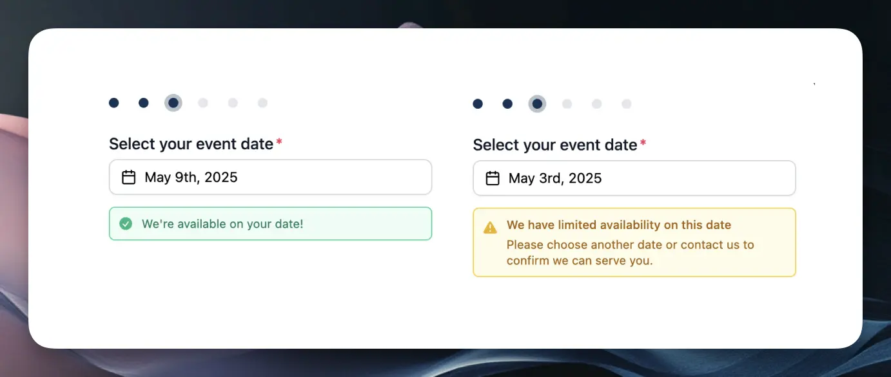
</Frame>

We're excited to introduce real-time availability indicators in your lead intake forms. This feature helps set clear expectations with potential customers from the start and saves you time by reducing inquiries for dates when you're already fully booked.

Key benefits include:

- **Visual date indicators:** Green and yellow dots instantly show customers your availability status
- **Clear messaging:** After selecting a date, customers receive straightforward availability notifications
- **Automatic updates:** Availability updates in real-time based on your blocked dates and resource capacity
- **Resource optimization:** Better manage your team and equipment allocation across events

The system intelligently combines your blocked dates and existing bookings to determine availability status for each date, creating a more transparent booking experience.

Learn more about this feature in our [Real-Time Availability](/forms/real-time-availability) documentation.

</Update>

<Update label="April 18, 2025">

## Instant Quoting

<Frame>
  
</Frame>

Transform your lead conversion process with our powerful new Instant Quoting feature. Now you can automatically generate and present quotes to clients immediately when they submit your lead intake form, enabling them to book instantly without any back-and-forth communication.

Key features include:

- **Instant Quote Generation**: Automatically calculate and present quotes using your configured pricing rules
- **Immediate Booking**: Clients can review and book quotes instantly upon form submission
- **Seamless Experience**: Direct redirect from form submission to quote presentation
- **Flexible Control**: Choose between manual review or instant quoting modes
- **Pro Plan Feature**: Available exclusively for [FlashQuotes Pro](https://app.flashquotes.com/settings/plans) subscribers

The system uses your existing instant pricing configurations to generate accurate quotes automatically, maintaining consistency while dramatically reducing the time from inquiry to booking.

Learn more about Instant Quoting in our documentation:

- [Instant Pricing & Quoting Guide](/leads/instant-pricing)
- [Lead Intake Form Configuration](/forms/lead-intake)
- [Quote Settings](/settings/quotes)

</Update>

<Update label="April 4, 2025">

## Automated Invoice Reminders

<Frame>
  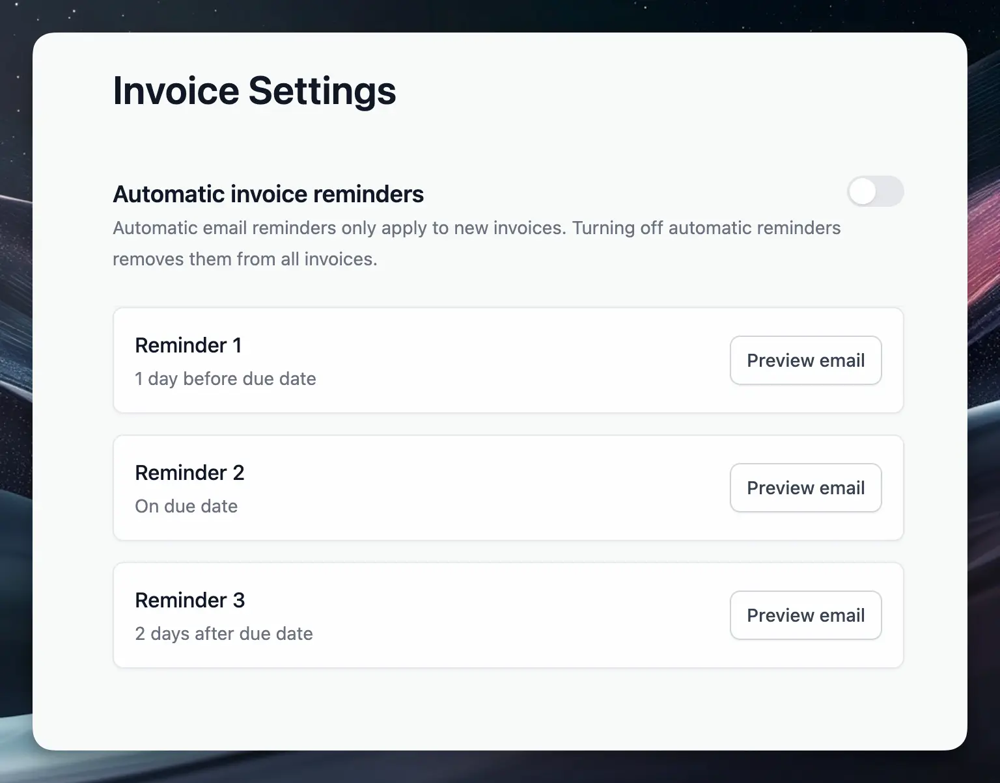
</Frame>

Never chase payments manually again! We've added automated invoice reminders that help ensure timely payments from your clients with minimal effort on your part.

Key features include:

- **Preset reminder schedule** with emails sent 1 day before due date, on the due date, and 2 days after
- **Email preview** option to review all reminder templates before they're sent
- **Toggle control** to easily enable or disable automated reminders

This feature complements the existing manual reminder capabilities, giving you a comprehensive system for payment follow-up that saves time while improving cash flow.

Learn more about this feature in our [Invoice Reminders](/invoices/reminders) documentation.

</Update>

<Update label="March 21, 2025">

## Automated Lead Follow-up with Workflows

<Frame>
  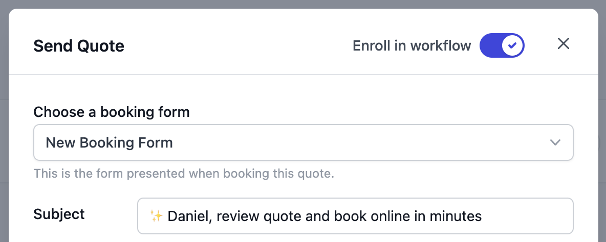
</Frame>

Transform your lead follow-up process with our powerful new Workflows feature. Now you can automatically nurture leads with perfectly timed, personalized email sequences that help convert more quotes into bookings.

Key features include:

- **Smart Email Sequences**: Pre-configured follow-up templates based on industry best practices
- **Dynamic Content**: Automatically insert quote details, lead information, and company data using shortcodes
- **Easy Enrollment**: One-click workflow enrollment when sending quotes
- **Full Visibility**: Track active workflows, scheduled emails, and lead engagement from both quote and lead views
- **Flexible Control**: Stop workflows automatically upon booking or manually when leads engage

The system intelligently handles multi-quote scenarios and automatically stops follow-ups when leads book, ensuring a professional experience throughout the sales process.

Learn more about Workflows in our documentation:

- [Workflows Overview](/workflows/overview)
- [Customizing Templates](/workflows/templates)
- [Managing Enrollments](/workflows/workflow-enrollments)
- [Understanding Triggers](/workflows/triggers)

</Update>

<Update label="March 14, 2025">

## Instant Pricing

<Frame>
  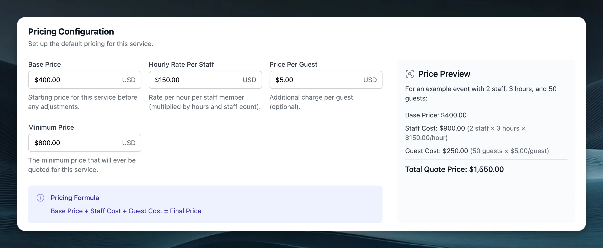
</Frame>

Save time and ensure consistent pricing with our new Instant Pricing feature. Now you can set up automatic price calculations for your services based on:

- Base service price
- Hourly rates per staff member
- Per-guest pricing
- Minimum price thresholds

When leads submit your intake forms, Flashquotes automatically generates draft quotes using your predefined pricing rules. This ensures consistent pricing across your business while still giving you the flexibility to review and adjust quotes before sending them to clients.

Check out our [Instant Pricing guide](/leads/instant-pricing) to learn how to set up automated pricing for your services.

</Update>

<Update label="February 21, 2025">

## Team Member Invitations

Bring your whole admin team onto Flashquotes with our new invitation system. You can now easily invite team members to join your company workspace directly through the platform. Head to Settings → Members to invite new users, manage pending invitations, and control user roles. Each invitation includes a secure, unique link that lets new users quickly join your workspace.

Note: You only need to invite admins to your workspace. Event staff can see everything they need without a Flashquotes account.

Check out our [team management guide](/settings/members) to learn more about inviting and managing team members.

</Update>

<Update label="February 14, 2025">

## Enhanced Quote Analytics

Track your lead engagement more effectively with our enhanced quote analytics. In addition to email open tracking, you can now monitor two crucial conversion metrics:

- Quote page views
- "Book Now" button clicks

These metrics appear as colored badges on both your lead list and quote details pages, making it easy to identify your hottest leads at a glance. Use these insights to time your follow-ups perfectly and focus on leads showing the strongest booking intent.

Check out the [quote analytics documentation](/leads/sending-quotes#tracking-quote-performance) to learn more about using these new metrics.

## Event Reminders for Staff

<Frame>
  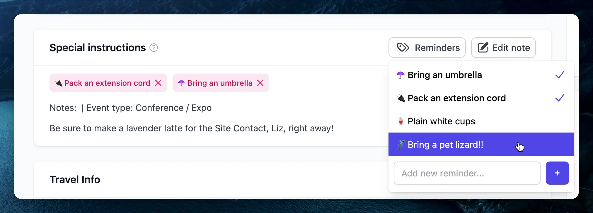
</Frame>

Keep your staff informed with our new Reminders feature. Tag events with important flags that appear prominently in both event details and event briefs. Whether it's equipment requirements, safety precautions, or special client requests, reminders ensure critical information is never overlooked. Create company-wide standard reminders or add custom ones for specific events. A warning banner at the top of event briefs ensures staff members are immediately aware of important details before starting their shift.

Learn more about using Reminders in our [detailed documentation](/events/reminders).

</Update>

<Update label="February 7, 2025">

## Send Quotes from Your Gmail Account

<Frame>
  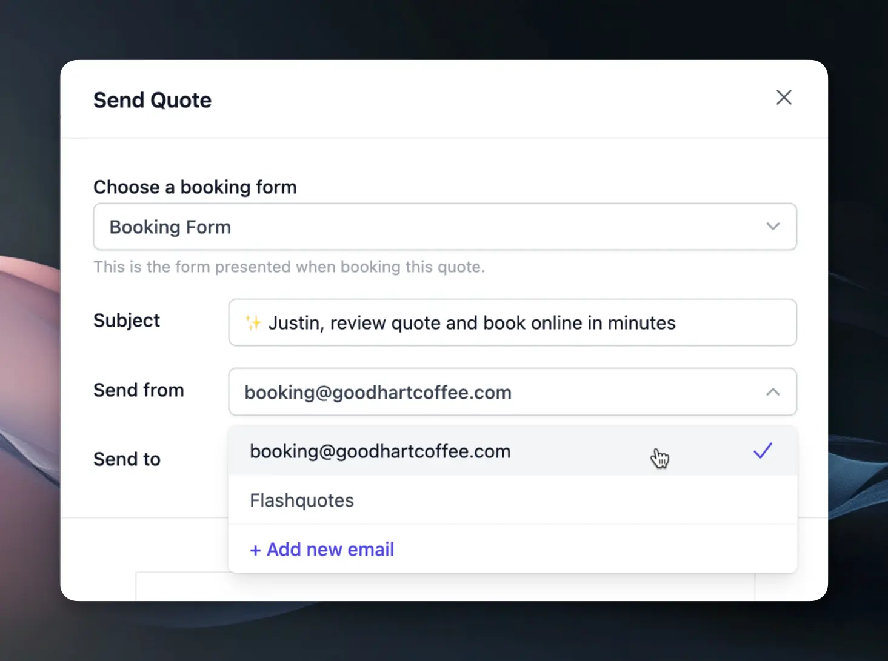
</Frame>
Connect your business Gmail account to send quotes directly from your own email address.
This integration creates a more personal experience for your clients, as they'll
receive quotes from your familiar business email. Your quotes maintain all their
interactive features while appearing more personalized in your client's inbox.

To get started, visit [Google Integrations](https://app.flashquotes.com/settings/integrations) in your settings to connect your Gmail account.

## Email Analytics & Engagement Tracking

<Frame>
  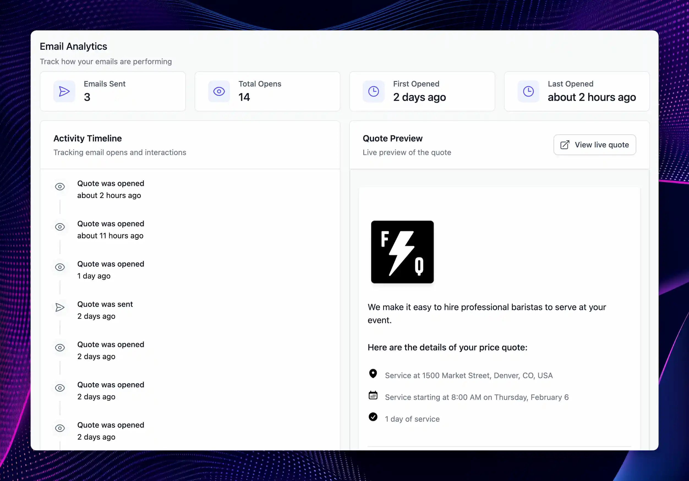
</Frame>

Track how leads interact with your quotes through our new email analytics feature. On the leads page, look for the eye icon next to sent quotes to instantly see how many times each quote has been viewed. For deeper insights, click into any sent quote to access a detailed activity timeline showing:

- Total email opens and unique views
- First and last open timestamps
- Complete chronological feed of all quote interactions

This visibility helps you time your follow-ups perfectly and focus on your most engaged leads.

Check out the [email analytics docs](/leads/sending-quotes#tracking-quote-performance) for more details.

</Update>

<Update label="January 2025">

## Customizable Quote Emails

<Frame>
  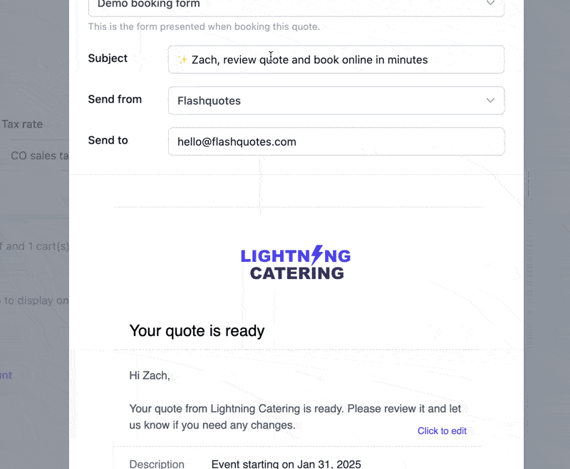
</Frame>

You can now fully edit the subject and body text of quote emails, allowing for more personalized messaging and branding. Whether you want to add a friendly touch, emphasize urgency, or tailor the language to your audience, you now have the flexibility to craft emails that resonate with your clients.

You can set a permanent default for the email body text in [Quote Settings](https://app.flashquotes.com/settings/quotes).

## New Multi-Select Question Type

<Frame>
  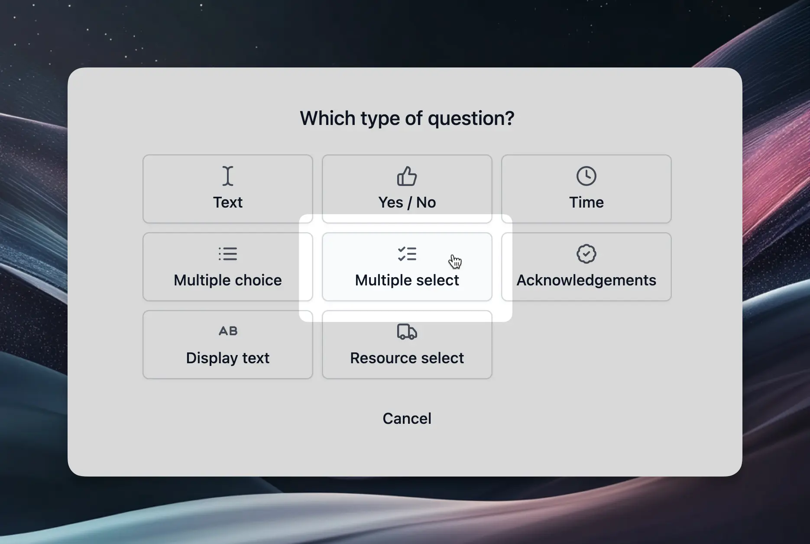
</Frame>

We've added a multi-select question type to Booking forms, allowing clients to choose multiple options in a single response. This is especially useful for event packages, customer flavor choices, etc.

Find this under Forms → Booking Forms → Add Question

## Copy Quotes with One Click

You can now copy any existing quote with a single click, making it easier to create new quotes based on past proposals. This is perfect for businesses with repeat clients or standard pricing structures.

Simply find the "Copy" option in the quote actions menu.

## In-App AI Help Chat

We've integrated Mintlify&apos;s AI-powered help chat directly into the app, making it easier than ever to get real-time assistance without leaving your workflow. Whether you need guidance on features, troubleshooting help, or best practices, our AI chat assistant is available to provide quick answers.

Try it out by clicking the Get Help icon in the bottom right corner of the Flashquotes dashboard.

</Update>

<Update label="December 2024">

## QuickBooks Online Integration

<Frame>
  
</Frame>

[Pro plan](https://app.flashquotes.com/settings/plans) customers can now sync their financial data with QuickBooks Online. The integration automatically creates customers, invoices, payments, and deposits in QuickBooks, with configurable account mappings and tax codes.

Payments are synced in real-time, including proper handling of sales tax and processing fees. The integration maintains your QuickBooks data structure while ensuring accurate financial reporting.

For more details, check out the [QuickBooks integration docs](/settings/integrations/quickbooks).

## Service Area Configuration

Define your service radius to automatically validate event addresses during quote submission. The system checks addresses in real-time against your specified radius. For events outside your service area, a warning banner notifies the client that additional travel fees may apply.

Your service area is defaulted to 150 miles, but you can change this in **[Quote Settings](https://app.flashquotes.com/settings/quotes)**.

## Lead Intake Form Settings

<Frame>
  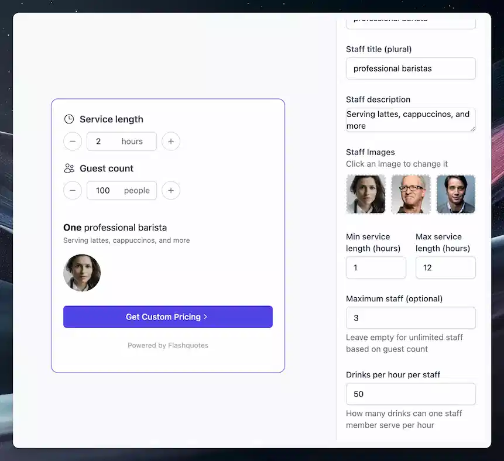
</Frame>

New configuration options include service duration limits, maximum staff counts, and custom redirect URLs after form submission. You can also customize the staff photos and descriptions in the lead intake form.

Form questions can now be fully customized. The system automatically generates optimized default forms for new accounts based on conversion data.

For more details, check out the [lead intake form docs](/forms/lead-intake).

</Update>

<Update label="November 2024">

## Zapier Integration Expansion

<Frame>
  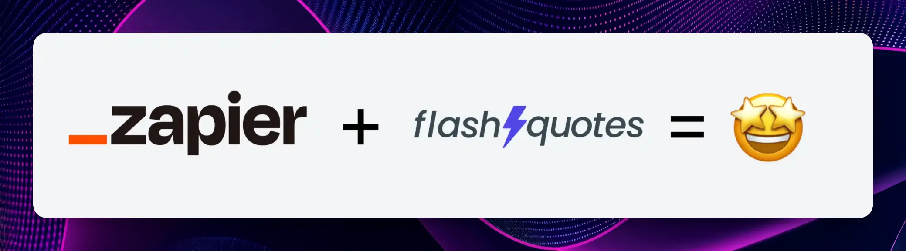
</Frame>

Three new Zapier triggers enable deeper workflow automation:

- **Quote form submission trigger** Send new leads directly to your CRM to streamline lead management.
- **Event timeline trigger** Keep your calendars synchronized with this new trigger which fires whenever event schedules change.
- **Staff assignment trigger** Automatically notify team members when they're assigned to events.

Read more about Zapier integration [here](/settings/integrations/zapier).

## Lead Intake Forms v2

<Frame>
  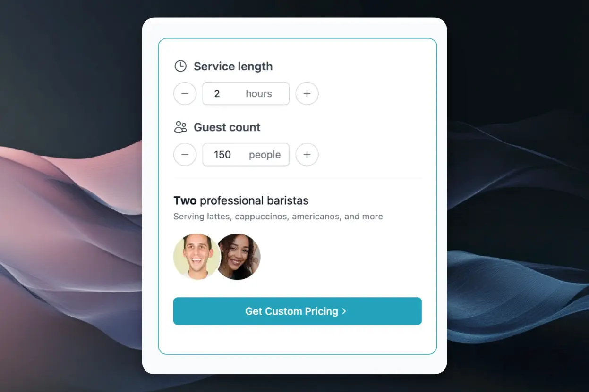
</Frame>

Lead intake forms are now fully customizable while maintaining high conversion rates. Find pre-configured forms under **Forms > Lead Intake Forms**, complete with proven questions and your brand colors automatically applied.

Platform-specific embed instructions make it simple to add forms to any website, whether you're using Webflow, Squarespace, WordPress, or other platforms. All leads flow directly into your Flashquotes dashboard for immediate follow-up.

Read more about lead intake forms [here](/forms/lead-intake).

## Enhanced Quote Customization

<Frame>
  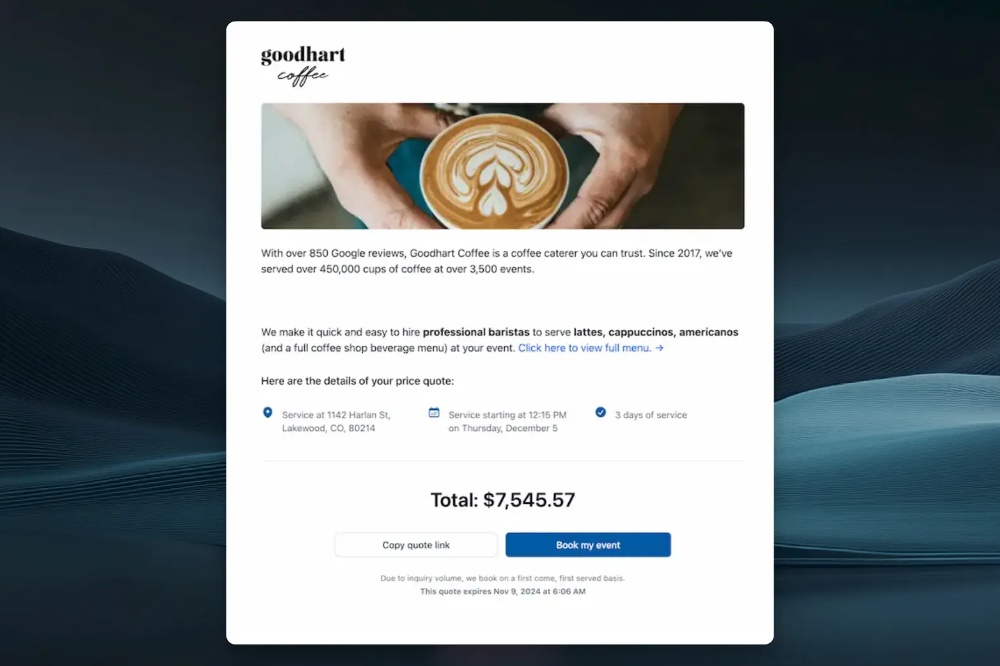
</Frame>

The quote editor now features a live preview as you build, showing exactly how your quote will appear to clients. Customize the hero text at the top of your quotes using markdown formatting for **bold** statements and embedded links. For more details, check out the [quote page docs](/docs/quotes).

Brand your quotes with custom hero images for each quote or set a default in company settings. Your brand colors now extend throughout customer-facing pages - set your signature color in **Settings > Branding** to have buttons and icons match your visual identity. Check out the [branding docs](/settings/branding) for more details.

</Update>

<Update label="October 2024">

## Lead Calendar

<Frame>
  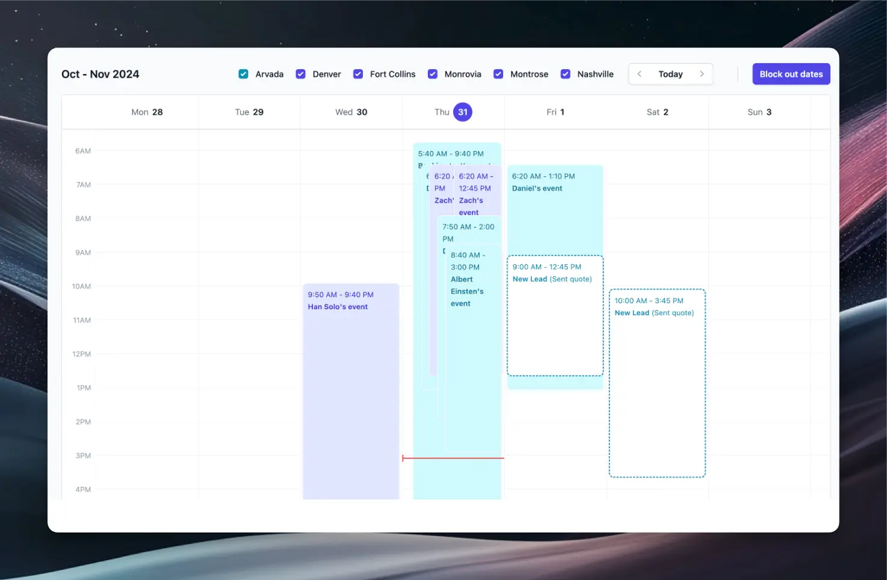
</Frame>

Your calendar now displays both confirmed bookings and potential events from quotes. Quoted events appear with dotted borders, giving you a complete view of upcoming business - both confirmed and potential.

## Sales Tax Reporting

<Frame>
  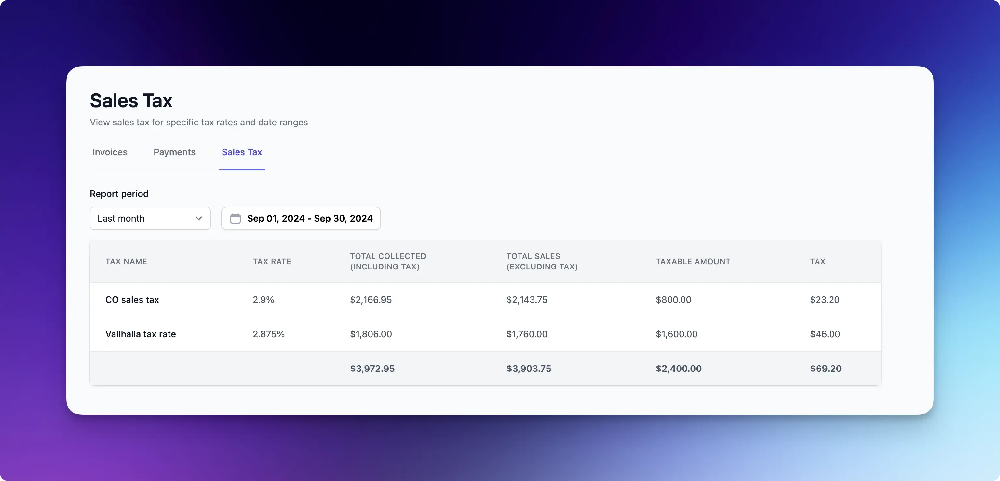
</Frame>

Managing sales tax across multiple jurisdictions is now simpler with our new automated tax reporting. Access comprehensive tax summaries under **Invoices > Sales Tax** to see your total sales, taxable amounts, and taxes owed.

The report breaks down tax data by rate, making it easy to handle different tax jurisdictions. All payment data in Flashquotes automatically flows into these reports, ensuring your numbers are always current.

Need historical data? Filter the report by different time periods, from last month to year-to-date, to get exactly the information you need for tax remittance.

## Resource Selection in Booking Forms

<Frame>
  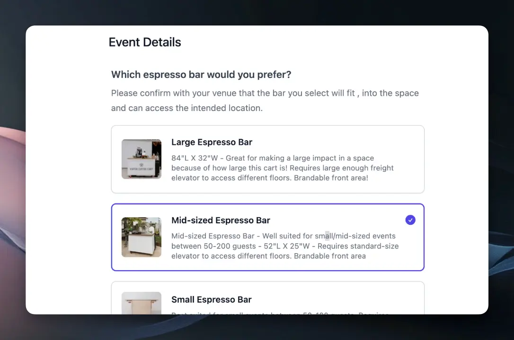
</Frame>

Let clients choose their preferred cart directly in your booking form with our new Resource Select question type. The form shows only carts available for the selected event date, complete with photos and descriptions you can customize in the resource settings.

When a booking is confirmed, the selected cart is automatically assigned to the event, streamlining your workflow and ensuring clients get exactly the setup they want.

## Native email sending

<Frame>
  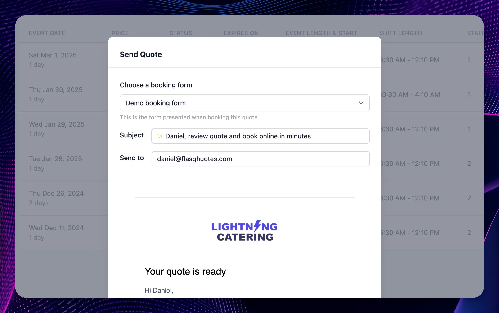
</Frame>

Now you can fire off **quote emails** directly from the quote page. Client quote emails include a link to the quote presentation page and the Book Now button
Click the new "Copy share link" button if you still want to copy/paste the quote link into a separate email

You can also send **invoice reminders** to clients with a single click. Preview the email before sending to ensure it looks great. Emails are branded with your logo and include a direct link to pay.

</Update>