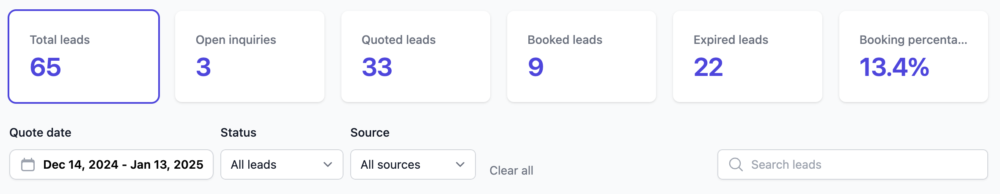

## Overview

The Leads section in Flashquotes helps you track and manage potential clients from initial inquiry through quote acceptance. Each lead contains essential event details and client information needed for quote generation.

## Lead Management

<AccordionGroup>
  <Accordion icon="inbox" title="Lead Dashboard">
    ### Key information
    The lead dashboard provides a quick overview of your leads, including contact information, lead source, and status.

    This is the best place to manage your active leads and will be your go-to workflow for quoting and converting leads to bookings.

    ### Filters
    - Filter leads by status, source, or date range
    - Search for leads by common fields like name, email, or phone number
    - Click on status cards to easily quick filter leads by status
    - Reference *Booking percentage* to measure how well you're converting leads to bookings

    

    <Tip>
      Use status indicators to quickly identify leads requiring attention.
    </Tip>

  </Accordion>

  <Accordion icon="user" title="Lead Details">
    Click on a leads access lead details and view all current quotes for the lead.
    The current quote statuses are displayed and will determine the workflow
    action.
    
    ### Quote statuses

    - **Draft**: A quote has been created but not yet sent. Build out this quote and send it to the lead.
    - **Sent** - A quote has been sent to the lead. Follow up with the lead to secure the booking.
    - **Booked** - A lead has booked the quoted event. Manage the [booking](/bookings) and [events](/events) to deliver amazing service
    - **Expired** - The sent quote has passed its expiration date. Customers cannot book expired quotes and will be prompted to request a new quote or contact you.

  </Accordion>

  <Accordion icon="arrows-split-up-and-left" title="Lead Journey">
  Follow leads through:
  - Initial inquiry
  - Quote generation
  - Quote delivery
  - Client communication and follow up
  - Quote acceptance and booking

<Tip>
	Sending out a quote within the first hour of inquiry can help you stand out
	and will increase your chance of securing the booking.
</Tip>

  </Accordion>

  <Accordion icon="calendar-clock" title="Managing Quote Expiration Dates">
    Admins can change individual quote expiration dates to extend opportunities or accommodate special circumstances.

    <Frame>
      
    </Frame>

    ### Where to Change Expiration Dates

    You can modify quote expiration from three locations:
    - **Lead Details Page**: Click on the lead, then edit the quote expiration
    - **Quote Edit Page**: When editing a quote, update the expiration field
    - **Quote View Page**: View the quote and click to modify expiration

    ### Common Scenarios

    **Extending About-to-Expire Quotes:**
    - If a client needs more time to decide, extend the expiration by a few days
    - This prevents the quote from expiring while negotiations are ongoing

    **Reactivating Expired Quotes:**
    - Change the expiration date to a future date to reactivate an expired quote
    - The quote becomes bookable again immediately

    **Removing Expiration:**
    - For special clients or situations, you can remove the expiration entirely
    - The quote will remain bookable indefinitely

    <Tip>
      Monitor quotes approaching expiration and proactively extend them if you're still in conversation with the lead.
    </Tip>

    <Warning>
      Remember that expired quotes cannot be booked by customers. They'll see a message prompting them to request a new quote or contact you directly.
    </Warning>
  </Accordion>
</AccordionGroup>

<Note>
	Most new leads are captured through the [lead intake form](/forms/lead-intake)
	embedded on your website, however, you can also add leads manually.
</Note>

## Best Practices

1. Respond to leads promptly
2. Keep lead information current
3. Track communication history
4. Monitor conversion rates
5. Follow up consistently

## Next Steps

After receiving leads:

- [Create quotes](/leads/quotes)
- [Send quotes](/leads/sending-quotes)
- Track responses
- Follow up with clients
