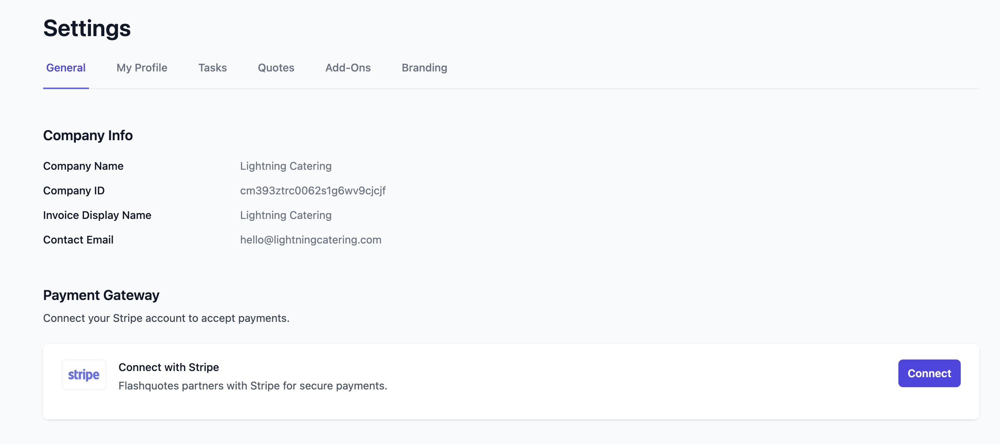
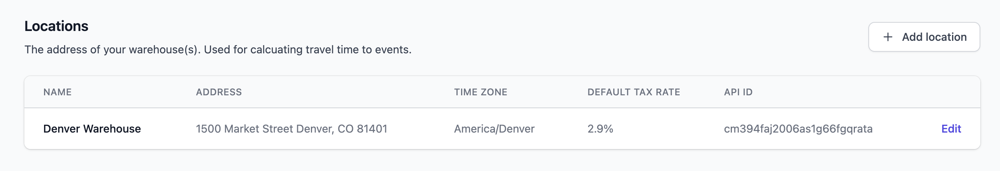
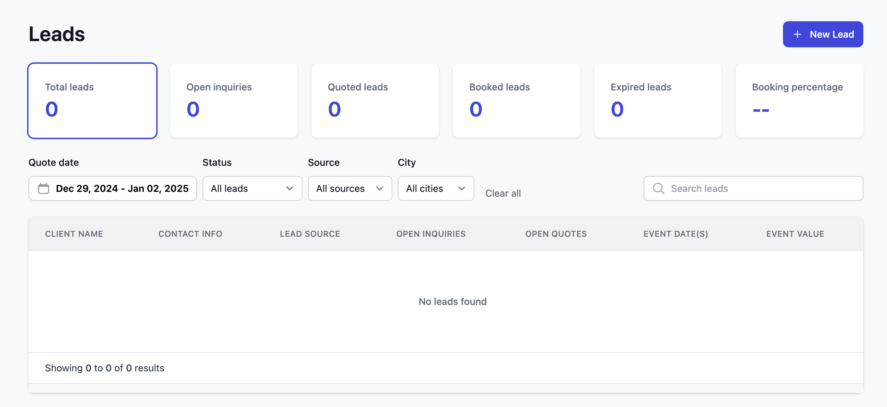
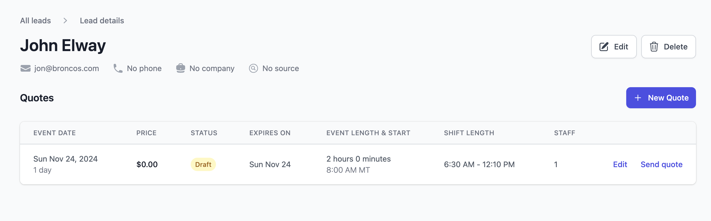

## 💳 Stripe Setup

<Warning>
  Flashquotes requires a connected Stripe account for handling payments and invoices.
</Warning>
<AccordionGroup>

  <Accordion icon="credit-card" title="Connect Stripe for Payments">

    1. Navigate to the [Settings](https://app.flashquotes.com/settings) page.
    2. Under `General`, find the Payment Gateway section.
    3. Click **Connect**.
    4. Follow the instructions to connect your existing Stripe account or create a new one.

    Once connected, you will see a green indicator confirming that Stripe is successfully linked.

    

  </Accordion>
</AccordionGroup>

---

## ⚙️ General Settings

<AccordionGroup>
  <Accordion icon="gear" title="Add Locations">
    Locations represent the headquarters or warehouse where your resources and team are based.

    1. Go to [General Settings](https://app.flashquotes.com/settings).
    2. Click the `+ Add location` button to add your locations.
    3. Add as many locations as needed for your operation.

    

    <Note>
     Locations will help in identifying which warehouse will be supporting an event, will be associated to your staff and resources, and can be used to build dynamic timelines so that your team always shows up on time.
    </Note>

  </Accordion>

  <Accordion icon="clock" title="Set Timeline Defaults">
    In [General Settings](https://app.flashquotes.com/settings), configure default timelines for key event stages like "Loading time" and "Setup time."

    These defaults are used to generate dynamic event timelines for all your events.

    <Info>
      Have a one-off event that needs a different timeline? No worries - you can change the timeline for any specific event as needed.
    </Info>

  </Accordion>

  <Accordion icon="palette" title="Brand Your App">
    Upload your logo and set a primary color in [Branding Settings](https://app.flashquotes.com/settings/branding).

    - Your logo will appear on customer-facing pages like quotes and invoices.
    - The primary color personalizes your app’s buttons and icons.

  </Accordion>
</AccordionGroup>

---

## 🚛 Resources

Add core resources like coffee carts, bar carts, vans, and trailers to link them to events in the app. This unlocks awesome features like real-time availability and insights into resource utilization.

<AccordionGroup>
  
  <Accordion icon="box" title="Add Resources">
    Resources like coffee carts, bar carts, vans, or trailers can be added in the [Resources](https://app.flashquotes.com/resources) section.

    1. Click `+ Add Resource`.
    2. Name and categorize the resource.
    3. Assign it to a location and set its availability for events.

    <Tip>
      Missing a location when trying to add a resource? Just [add your locations](/quickstart#general-settings) and they’ll become available for resource assignment.
    </Tip>

  </Accordion>
</AccordionGroup>

---

## 👥 Staff

By adding your staff, you enable these team members to be linked to events throughout the application and help avoid double booking your staff for upcoming events.

<AccordionGroup>
  <Accordion icon="users" title="Add Staff">
    Add your team members in the [Staff](https://app.flashquotes.com/staff) section.

    - Assign roles (e.g., "Barista") and locations.
    - Ensure contact information is complete for easy event coordination.

    <Tip>
      Missing a location when trying to add staff? Just [add your
      locations](/quickstart#general-settings) and they’ll become available for
      staff assignment.
    </Tip>

  </Accordion>
</AccordionGroup>

---

## 📋 Forms

Forms allow you to build custom and flexible experiences to collect important information from your customers. This is especially important when allowing your customers to book your services.

<AccordionGroup>
  <Accordion icon="file-invoice" title="Configure Booking Form">
    Configure the form used to collect customer information during the booking process.

    1. Go to [Forms](https://app.flashquotes.com/forms).
    2. Click on the auto-generated `New Booking Form`.
    3. Update, add or delete form questions as needed.
    4. Customize settings like redirect URLs and payment schedules.

    Remember to **Publish** your form once it’s ready.

  </Accordion>
<Accordion icon="user" title="Embed Lead Intake Form">
    Embed the lead intake form on your website to receive quote requests from leads.

    1. Go to [Forms](https://app.flashquotes.com/forms).
    2. Click on the auto-generated `New Lead Intake Form`.
    3. Configure form questions and settings.
    4. Click on `Embed Form` to get the embed code.
    5. Follow instructions to embed the form on your website.

    Remember to **Publish** your form once it’s ready.

  </Accordion>
  
</AccordionGroup>

---

## ✅ Task Templates

Task templates are a powerful way to ensure your admin and event team are completing specific tasks for every event you book. This helps ensure your team doesn’t miss a beat in delivering a great event.

<AccordionGroup>
<Accordion icon="square-check" title="Add Admin Task Templates">
    In [Task Settings](https://app.flashquotes.com/settings/tasks), you can setup your Admin Task Templates. These tasks will be added to the Overview section of each event and will be clearly presented in the [Events](https://app.flashquotes.com/events) section. You can also include a Default Due Date for each task, to ensure they’re completed timely.

    <Tip>
    Have an event that requires a unique task? Just add or edit admin tasks in the Overview section of the event.
    </Tip>

  </Accordion>
  <Accordion icon="square-check" title="Add Event Brief Task Templates">
    In [Task Settings](https://app.flashquotes.com/settings/tasks), you can setup your Event Brief Task Templates. These tasks will be added to the Event brief section of each event and, most importantly, will be presented in the public event brief document to share with your event team.

Each task can be put in a specific order and assigned to a section of the event brief (e.g. “Prep & Loading” or “Service”). This way, your event team can reference the event brief throughout working the event to make sure all tasks are complete.

<Tip>
	Have an event that requires a unique task? Just add or edit event brief tasks
	in the Event brief section of your event.
</Tip>

  </Accordion>
  <Accordion icon="markdown" title="Use Markdown in Tasks">
    You can add specific styling or hyperlinks in your tasks using standard [Markdown syntax](https://www.markdownguide.org/basic-syntax/). This allows you to format text in a way that best suits your needs.

    Here are some common Markdown styles to get you started:

    - Surround text with two asterisks `**` to **bold** it.
      - Example: `**This** is bold` results in "**This** is bold".
    - Surround text with one asterisk `*` to *italicize* it.
      - Example: `*This* is italicized` results in "*This* is italicized".
    - Surround text in brackets `[]` followed by a URL in parentheses `()` to create a hyperlink.
      - Example: `Take me to [Google](https://google.com)` results in "Take me to [Google](https://google.com)".

    Use these Markdown tips to make your task titles clear, engaging, and useful.

  </Accordion>
  
</AccordionGroup>

---

## ✨ Add-Ons

Use add-ons for all the extra services and customizations that your customers can add to their order beyond your basic service offering. These add-ons will be used throughout Flashquotes, including your quote line items, event details and event brief, invoice line items, etc.

<AccordionGroup>
  <Accordion icon="star" title="Create Add-Ons">
    In [Add-Ons Settings](https://app.flashquotes.com/settings/addons), create add-on services that customers can add to their order.

    1. Click `+ Create Add-On`.
    2. Add a name, description, price type (e.g., "Flat Price" or "Per Guest"), and price for each add-on.

    <Tip>
      The price types are especially helpful in auto-calculating the appropriate add-on price as you’re preparing quotes for your customers.
    </Tip>

  </Accordion>
</AccordionGroup>

---

## 📬 Send Your First Quote

Let’s walk through how to send a quote from Flashquotes

<AccordionGroup>
	<Accordion icon="user" title="Create a Lead">

    1. Go to the [Leads](https://app.flashquotes.com/leads) page.
    2. Click on a Lead or create one by clicking `+ New Lead`.

    

  </Accordion>
	<Accordion icon="file" title="Create a Quote">

    1. From the [Leads](https://app.flashquotes.com/leads) page, click `+ New Quote` to create a new quote.
    2. Input the Address, Service Location, Date and Time and click `Create`.
    3. You'll land on the quote editing screen. From here you can:
      - add line items, discounts, and taxes
      - add / edit details about the event service
      - customize the look of the quote view

    

  </Accordion>
<Accordion icon="paper-plane" title="Send a Quote">

    1. When you’re ready to send it, click `Send quote`. You’ll need to choose one of your booking forms to link to the *Book my event* button.
    2. Click `Send`. An email version of the Quote will be sent to the lead with a link to instantly book.
    3. Sit back and wait for the bookings to roll in!

    

   </Accordion>

</AccordionGroup>

---

## Questions?

Contact us at [support@flashquotes.com](mailto:support@flashquotes.com).
